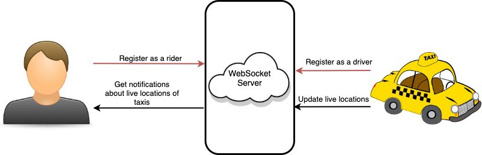

# Taxi Management Service

## Overview

This example shows how to use the Ballerina WebSocket package to implement a simple taxi service management application. This is certainly a simplified representation of a real-life implementation created for demonstration purposes.
There are three parties involved:
1. Taxi Management Service — The intermediate WebSocket server. Use the server application.
2. Drivers — Use the driver application
3. Riders — Use the rider application



Drivers and riders can register for the Taxi Management Service. Assume that the drivers and riders are given separate applications to register. Starting that application will register the drivers and riders. Then the drivers’ locations will be shared with riders. 

The WebSocket server acts as the intermediary between the riders and the drivers. All the data will be transferred through the server.
Users are capable of registering as riders via the rider application. Once they register, they’ll be updated about the availability of drivers and their locations. Driver locations will be updated as they move. 

## Implementation

### The WebSocket Server
The WebSocket server behaves as the intermediate server between the users and drivers. So, drivers can send their location details to the server, and once a user gets registered, he/she will be notified of the real-time locations of those drivers.

### Rider - WebSocket Client
After registering, riders will get updates about the live locations of taxis. Taxi location details will get printed on the console once you start the driver code sample.

### Driver - WebSocket Client
Drivers send their locations to the WebSocket server, and users will be updated via the server.

## Run the Example

First, clone this repository, and then run the following commands to run this example in your local machine.

```sh
// Run the WebSocket server
$ cd examples/taxi-service-management/server
$ bal run
```

In another terminal, run the rider application as follows.
```sh
// Run the WebSocket rider application
$ cd examples/taxi-service-management/rider
$ bal run
```

Again in another terminal, run the driver application as follows.
```sh
// Run the WebSocket driver application
$ cd examples/taxi-service-management/driver
$ bal run
```